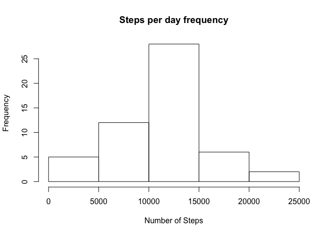
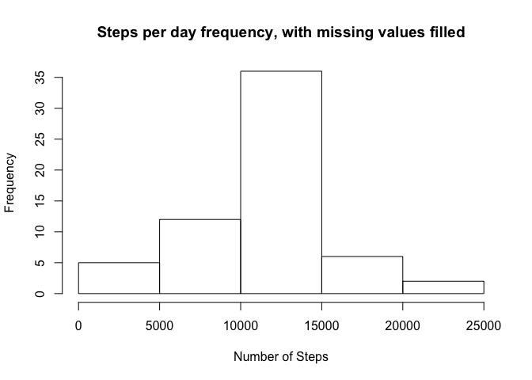
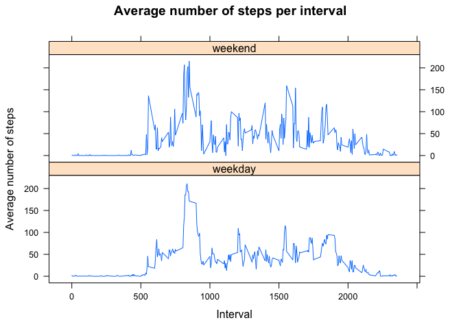

# Reproducible Research: Peer Assessment 1

## Setup Tasks

```r
library(dplyr)
```

```
## 
## Attaching package: 'dplyr'
```

```
## The following objects are masked from 'package:stats':
## 
##     filter, lag
```

```
## The following objects are masked from 'package:base':
## 
##     intersect, setdiff, setequal, union
```

```r
library(lattice)
```

## Loading and preprocessing the data

```r
setwd('/Users/prosales/code_base/ds_certificate/RepData_PeerAssessment1')
source_data_df <- read.csv(unzip('activity.zip'))

cleansed_df <- source_data_df %>% na.omit()
cleansed_df$date <- as.character(cleansed_df$date)
```


## What is mean total number of steps taken per day?

```r
# Number of steps per day
steps_x_day_df <- with(cleansed_df, aggregate(steps, by=list(Category = date), FUN=sum))
colnames(steps_x_day_df) <- c('date', 'sum_of_steps')

# histogram
hist(steps_x_day_df$sum_of_steps, main = 'Steps per day frequency', xlab = 'Number of Steps', ylab = 'Frequency')
```

<!-- -->

### Steps per day: Mean

```r
mean(steps_x_day_df$sum_of_steps)
```

```
## [1] 10766.19
```

### Steps per day:  Median

```r
median(steps_x_day_df$sum_of_steps)
```

```
## [1] 10765
```


## What is the average daily activity pattern?

```r
# time series plot
avg_steps_x_interval_df <- with(cleansed_df, aggregate(steps, by=list(Category = interval), FUN=mean))
colnames(avg_steps_x_interval_df) <- c('interval', 'avg_steps')

plot(x = avg_steps_x_interval_df$interval, y = avg_steps_x_interval_df$avg_steps, type = 'l', main = 'Average Number of Steps per Interval', ylab = 'Average Number of Steps', xlab = 'Interval')
```

<!-- -->

### Interval with the average maximum number of steps

```r
interval_with_max_avg_steps <- filter(avg_steps_x_interval_df, avg_steps == max(avg_steps_x_interval_df$avg_steps))$interval

interval_with_max_avg_steps
```

```
## [1] 835
```


## Imputing missing values

```r
# Number of rows with missing (NA) "values"
na_row_count <- nrow(source_data_df) - nrow(cleansed_df)

# fill missing values; strategy:  fill in with average steps for that interval
na_values_df <- filter(source_data_df, is.na(steps)) 
filled_na_values_df <- merge(na_values_df, avg_steps_x_interval_df, by = 'interval')
filled_na_values_df <- filled_na_values_df[, c('avg_steps', 'date', 'interval')]
colnames(filled_na_values_df) <- c('steps', 'date', 'interval')
filled_na_values_df$date <- as.character(filled_na_values_df$date)

# complete dataset with NA values, filled
completed_data_df <- union(cleansed_df, filled_na_values_df)

# Number of steps per day
steps_x_day_complete_df <- with(completed_data_df, aggregate(steps, by=list(Category = date), FUN=sum))
colnames(steps_x_day_complete_df) <- c('date', 'sum_of_steps')

# histogram
hist(steps_x_day_complete_df$sum_of_steps, main = 'Steps per day frequency, with missing values filled', xlab = 'Number of Steps', ylab = 'Frequency')
```

<!-- -->


### Steps per day, with filled values: Mean 

```r
mean(steps_x_day_complete_df$sum_of_steps)
```

```
## [1] 10766.19
```

### Steps per day, with filled values: Median 

```r
median(steps_x_day_complete_df$sum_of_steps)
```

```
## [1] 10766.19
```

## Are there differences in activity patterns between weekdays and weekends?

```r
fn_weekday_type <- function(day_of_week) {
     weekday_type = 'weekday'
     
     if (day_of_week %in% c('Sunday', 'Saturday')) {
          weekday_type = 'weekend'          
     }
     
     return(weekday_type)
}

completed_data_df$day_of_the_week <- weekdays(as.Date(steps_x_day_complete_df$date, '%Y-%m-%d'))
completed_data_df <- completed_data_df %>% rowwise() %>% mutate(weekday_type = fn_weekday_type(day_of_the_week))

completed_data_df$weekday_type <- as.factor(completed_data_df$weekday_type)

avg_steps_by_weekday_type_df <- with(completed_data_df, aggregate(steps, by=list(Category = weekday_type, interval), FUN=mean))
colnames(avg_steps_by_weekday_type_df) <- c('weekday_type', 'interval', 'avg_steps')

with(avg_steps_by_weekday_type_df, xyplot(avg_steps ~ interval | weekday_type, layout=c(1,2), type = 'l', main = 'Average number of steps per interval', xlab = 'Interval', ylab = 'Average number of steps'))
```

<!-- -->
